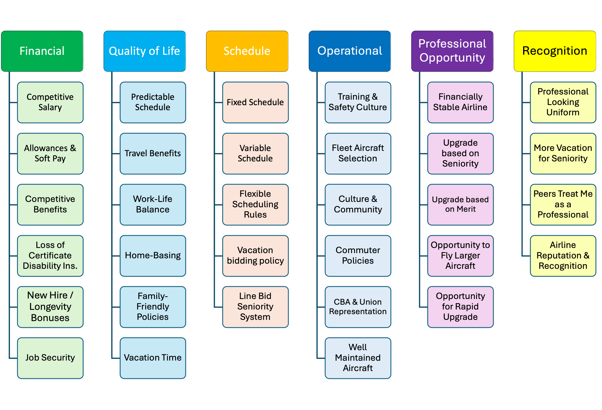

# Overview

**Repository:** [GitHub][repo-url]

This analysis examines pilot retention priorities from a survey of U.S. regional airline pilots (n = 57). This regional-only analysis was conducted as a sensitivity analysis to address scope-sample alignment, as regional carriers comprised 75% of the original sample.

The analysis has two parts:

1.  **General Retention Factors** - Rankings of six broad retention constructs and demographic comparisons
2.  **Subfactor Analysis** - Within-construct priorities for 31 specific retention elements

{#fig-retention-factors}

# Statistical Methods

## Sample and Data Collection

Survey data was collected from U.S. airline pilots during April and May 2025. After exclusions for incomplete responses, non-air carrier pilots, and restriction to regional airline pilots only, n = 57 valid responses remained for analysis. This regional-only subset addresses the original study's scope-sample alignment, where 75% of respondents were regional pilots.

## Statistical Tests

All ranking data is ordinal; therefore, non-parametric tests are used throughout:

-   **Friedman Test**: Within-subjects comparison of factor rankings
-   **Mann-Whitney U**: Between-groups comparison for binary demographics
-   **Kruskal-Wallis H**: Between-groups comparison for multi-level demographics

## Multiple Testing Correction

This quantitative study employs a **hierarchical false discovery rate (FDR) control procedure**:

**General Factor Analysis (24 tests):** Benjamini-Hochberg FDR at q = 0.10 applied across all demographic comparisons (6 factors x 4 demographics; carrier type excluded in regional-only analysis).

**Subfactor Analysis (155 tests):** Two-step hierarchical procedure:

1.  **Screening**: For each construct, compute minimum p-value across demographics. Apply BH-FDR at q = 0.10 to these 6 screening p-values.
2.  **Within-construct testing**: For constructs passing screening, apply Holm's procedure at alpha = 0.05 to demographic comparisons.

**Rationale**: Standard Bonferroni correction (alpha/155 = 0.0003) is overly conservative for exploratory research, causing 50-70% Type II error rates. FDR control at q = 0.10 balances discovery against false positives appropriately for hypothesis generation.

## Effect Sizes

-   **Mann-Whitney U**: Rank-biserial correlation r (small \< .3, medium .3-.5, large \> .5)
-   **Kruskal-Wallis**: Eta-squared (small \< .01, medium .01-.06, large \> .06)

## Software

Analysis conducted in Positron (Version: 2025.12.2 build 5) with R 4.5.2 using: tidyverse, rstatix, coin, DescTools, knitr, janitor.

**Code Availability:** The complete analysis code is available at `scripts/analysis/unified_retention_analysis-mod57.qmd` in the [GitHub repository][repo-url]. The original full-sample analysis (n=76) is available at `scripts/analysis/unified_retention_analysis.qmd`.

[repo-url]: https://github.com/mikehickey2/US-Airline-Pilot-Retention-Analysis

# Setup

```{r}
#| label: setup
#| include: false

# Core tidyverse
library(tidyverse)
library(dplyr)
library(tidyr)
library(stringr)
library(readr)

# Statistics
library(rstatix)
library(DescTools)
library(coin)

# Validation
library(checkmate)

# Tables and output
library(knitr)
library(janitor)

# Utilities
library(here)

# Source helper functions
source(here("R/retention_helpers.R"))

# Global options
options(scipen = 999)
knitr::opts_chunk$set(fig.width = 10, fig.height = 6)

# Create output directories for regional-only analysis
dir.create(
  here("output/tables/unified_analysis_regional"),
  showWarnings = FALSE,
  recursive = TRUE
)
dir.create(
  here("output/figures/unified_analysis_regional"),
  showWarnings = FALSE,
  recursive = TRUE
)
```

# Data Loading and Preprocessing

```{r}
#| label: load-data
# Load raw survey data
raw <- read_csv(
  here("data/processed/retention.csv"),
  show_col_types = FALSE
)

# Row 1 = headers; rows 2-3 are survey text & metadata → drop them
retention_data <- raw %>%
  slice(-(1:2)) %>%
  clean_names()

# Remove unwanted metadata columns
ignore_cols <- c(
  "start_date", "end_date", "status", "progress", "duration_in_seconds",
  "recorded_date", "response_id", "distribution_channel",
  "user_language", "q_recaptcha_score"
)
retention_data <- retention_data %>% select(-all_of(ignore_cols))

# Filter out exclusions
total_records <- nrow(retention_data)

cleaned <- retention_data %>%
  mutate(
    finished         = toupper(as.character(finished)),
    informed_consent = toupper(as.character(informed_consent)),
    screener         = toupper(as.character(screener))
  ) %>%
  mutate(
    exclusion_reason = case_when(
      informed_consent != "YES"  ~ "did_not_consent",
      finished         != "TRUE" ~ "did_not_finish",
      screener         != "YES"  ~ "not_air_carrier",
      TRUE                       ~ "included"
    )
  )

# Exclusion summary table
exclusion_table <- cleaned %>%
  count(exclusion_reason, name = "n")

kable(exclusion_table, caption = "Data Exclusion Summary")

# Keep only included records
included_data <- cleaned %>%
  filter(exclusion_reason == "included") %>%
  select(-exclusion_reason)

# ============================================================================
# SCOPE RESTRICTION: Regional Airlines Only
# ============================================================================
# Filter to regional airline pilots only for this sensitivity analysis
# This addresses reviewer concerns about scope-sample alignment

included_data <- included_data %>%
  filter(str_detect(air_carrier_type, "Regional"))

# Verify regional-only filter
regional_n <- nrow(included_data)
```

::: {.callout-note}
## Scope Restriction
This analysis is restricted to **regional airline pilots only** (n = `r nrow(included_data)`).
The original sample contained 76 pilots across carrier types (Regional: 57, Major: 11, LCC: 5, Other: 3).
:::

```{r}
#| label: recode-demographics
#| output: false

# Convert numeric variables
included_data <- included_data %>%
  mutate(
    age = as.numeric(age),
    experience = as.numeric(experience),
    total_flying_hours = as.numeric(total_flying_hours)
  )

# ============================================================================
# DEMOGRAPHIC VARIABLES
# ============================================================================

# 1. Age Group (binary: ≤35 vs >35)
included_data <- included_data %>%
  mutate(age_group = if_else(age <= 35, "≤ 35", "> 35"))

# 2. Experience Quartiles (4 levels)
included_data <- included_data %>%
  mutate(
    exp_q = ntile(experience, 4),
    exp_q = factor(exp_q,
                   levels = 1:4,
                   labels = c("Q1 (least)", "Q2", "Q3", "Q4 (most)"))
  )

# 3. Gender (cleaned: Male/Female/Other)
included_data <- included_data %>%
  mutate(
    gender_raw = trimws(gender),
    gender_clean = case_when(
      str_starts(tolower(gender_raw), "m")         ~ "Male",
      str_starts(tolower(gender_raw), "f")         ~ "Female",
      str_detect(tolower(gender_raw), "non|other") ~ "Other",
      TRUE                                         ~ NA_character_
    )
  )

# 4. Military Background (binary: Yes/No)
included_data <- included_data %>%
  mutate(
    military_clean = case_when(
      military_experience == "Previously served in the military" ~ "Yes",
      military_experience == "Never served in the military"      ~ "No",
      TRUE                                                       ~ NA_character_
    )
  )

# 5. Flight-Deck Position (binary: Captain/First Officer)
included_data <- included_data %>%
  mutate(
    position = case_when(
      str_detect(tolower(position_position), "captain")       ~ "Captain",
      str_detect(tolower(position_position), "first officer") ~ "First Officer",
      TRUE                                                    ~ NA_character_
    )
  )

# 6. Carrier Type (4 categories)
included_data <- included_data %>%
  mutate(
    carrier_grp = case_when(
      str_detect(air_carrier_type, "Regional")        ~ "Regional",
      str_detect(air_carrier_type, "Legacy|Mainline") ~ "Major",
      str_detect(air_carrier_type, "Low Cost")        ~ "LCC",
      TRUE                                            ~ "Other"
    )
  )

# 7. Respondent ID (for within-subjects tests)
included_data <- included_data %>%
  mutate(respondent_id = row_number())

# ============================================================================
# RENAME GENERAL FACTOR COLUMNS (for Part 1)
# ============================================================================
# Map general_1-6 to meaningful names for Part 1 analysis
included_data <- included_data %>%
  rename(
    financial_rank    = general_1,
    lifestyle_rank    = general_2,
    professional_rank = general_3,
    recognition_rank  = general_4,
    schedule_rank     = general_5,
    operational_rank  = general_6
  )

# Store rank column names for Part 1
rank_cols <- c("financial_rank", "lifestyle_rank", "professional_rank",
               "recognition_rank", "schedule_rank", "operational_rank")
```

```{r}
#| label: tbl-sample-summary
#| tbl-cap: "Sample Demographic Summary"

# Create sample summary table
sample_summary <- tibble(
  Demographic = c("Age Group", "", "Experience", "", "", "",
                  "Gender", "", "", "Military Background", "",
                  "Position", "", "Carrier Type", "", "", ""),
  Category = c("≤ 35 years", "> 35 years",
               "Q1 (least)", "Q2", "Q3", "Q4 (most)",
               "Male", "Female", "Other/NA",
               "Yes", "No",
               "Captain", "First Officer",
               "Regional", "Major", "LCC", "Other"),
  n = c(sum(included_data$age_group == "≤ 35", na.rm = TRUE),
        sum(included_data$age_group == "> 35", na.rm = TRUE),
        sum(included_data$exp_q == "Q1 (least)", na.rm = TRUE),
        sum(included_data$exp_q == "Q2", na.rm = TRUE),
        sum(included_data$exp_q == "Q3", na.rm = TRUE),
        sum(included_data$exp_q == "Q4 (most)", na.rm = TRUE),
        sum(included_data$gender_clean == "Male", na.rm = TRUE),
        sum(included_data$gender_clean == "Female", na.rm = TRUE),
        sum(is.na(included_data$gender_clean) | included_data$gender_clean == "Other"),
        sum(included_data$military_clean == "Yes", na.rm = TRUE),
        sum(included_data$military_clean == "No", na.rm = TRUE),
        sum(included_data$position == "Captain", na.rm = TRUE),
        sum(included_data$position == "First Officer", na.rm = TRUE),
        sum(included_data$carrier_grp == "Regional", na.rm = TRUE),
        sum(included_data$carrier_grp == "Major", na.rm = TRUE),
        sum(included_data$carrier_grp == "LCC", na.rm = TRUE),
        sum(included_data$carrier_grp == "Other", na.rm = TRUE))
)

kable(sample_summary)
```

**Final sample:** `r nrow(included_data)` pilots included in analysis.

# Part 1: General Retention Factor Analysis

This section analyzes the rankings of six broad retention constructs:

1.  Financial (salary, benefits, bonuses)
2.  Quality of Life/Lifestyle (schedule, family, work-life balance)
3.  Professional Opportunity (stability, upgrade, aircraft type)
4.  Recognition (uniform, respect, awards)
5.  Schedule (fixed vs variable, bidding systems)
6.  Operational (SOPs, training, equipment, pilot skill)

## Descriptive Statistics

```{r}
#| label: rq1-descriptives
#| fig-cap: "Distribution of top-ranked retention factors among regional airline pilots"
#| fig-alt: "Bar chart showing the number of pilots ranking each of six retention factors as most important"

# Build long-format data for general factors
general_long <- included_data %>%
  select(respondent_id, all_of(rank_cols)) %>%
  pivot_longer(
    cols = all_of(rank_cols),
    names_to = "factor",
    values_to = "rank"
  ) %>%
  mutate(
    factor = str_remove(factor, "_rank$"),
    rank = as.numeric(rank)
  )

# Table 1: Median rank and IQR for each factor
rank_summary <- general_long %>%
  group_by(factor) %>%
  summarise(
    n      = n(),
    median = median(rank, na.rm = TRUE),
    iqr    = IQR(rank, na.rm = TRUE),
    mean   = mean(rank, na.rm = TRUE),
    sd     = sd(rank, na.rm = TRUE),
    .groups = "drop"
  ) %>%
  arrange(median)

kable(rank_summary, digits = 2,
      caption = "Table 1: Rank Summary for General Retention Factors")

# Table 2: Count of pilots ranking each factor #1
top_factor_tbl <- general_long %>%
  filter(rank == 1) %>%
  count(factor, name = "n") %>%
  mutate(percent = n / sum(n) * 100) %>%
  arrange(desc(n))

kable(top_factor_tbl, digits = 1,
      caption = "Table 2: Number (and %) of Pilots Ranking Each Factor #1")

# Bar chart: Most important retention factor
ggplot(top_factor_tbl, aes(x = reorder(factor, -n), y = n)) +
  geom_bar(stat = "identity", fill = "steelblue") +
  labs(
    title = "Figure 1: Most Important Retention Factor",
    x = "Factor Ranked #1",
    y = "Number of Pilots"
  ) +
  theme_minimal() +
  theme(axis.text.x = element_text(angle = 45, hjust = 1))
```

## Friedman Test: Overall Factor Rankings

```{r}
#| label: rq1-friedman
# Friedman test: Do the 6 retention factors differ in importance?
friedman_res <- general_long %>%
  rstatix::friedman_test(rank ~ factor | respondent_id)

kable(friedman_res, digits = 3,
      caption = "Friedman Test: Overall Difference in Factor Rankings")

# Post-hoc pairwise comparisons (Wilcoxon signed-rank with Holm adjustment)
pairwise_tbl <- general_long %>%
  rstatix::pairwise_wilcox_test(
    rank ~ factor,
    paired = TRUE,
    p.adjust.method = "holm"  # Holm for dependent tests
  ) %>%
  mutate(
    comparison = str_c(group1, " vs ", group2),
    p.adj = round(p.adj, 4),
    sig = if_else(p.adj < 0.05, "*", "")
  ) %>%
  select(comparison, statistic, p, p.adj, sig)

kable(pairwise_tbl, digits = 4,
      caption = "Table 3: Pairwise Wilcoxon Tests Between General Factors (Holm-adjusted)")
```

## Demographic Comparisons

### Age Groups (≤35 vs \>35)

```{r}
#| label: rq2a-age
# Long format with age group
general_age_long <- included_data %>%
  select(age_group, all_of(rank_cols)) %>%
  pivot_longer(
    cols = all_of(rank_cols),
    names_to = "factor",
    values_to = "rank"
  ) %>%
  mutate(
    factor = str_remove(factor, "_rank$"),
    rank = as.numeric(rank)
  )

# Summary table: medians by age group
age_medians <- general_age_long %>%
  group_by(factor, age_group) %>%
  summarise(
    n = n(),
    median = median(rank, na.rm = TRUE),
    .groups = "drop"
  ) %>%
  pivot_wider(
    names_from = age_group,
    values_from = c(n, median),
    names_glue = "{age_group}_{.value}"
  )

# Mann-Whitney U tests per factor
mw_age <- general_age_long %>%
  group_by(factor) %>%
  rstatix::wilcox_test(rank ~ age_group, exact = FALSE) %>%
  ungroup() %>%
  mutate(
    p_raw = p,
    p_adj_fdr = p.adjust(p, method = "BH"),
    sig_fdr10 = if_else(p_adj_fdr < 0.10, "*", "")
  ) %>%
  select(factor, statistic, p_raw, p_adj_fdr, sig_fdr10, n1, n2)

# Combined results
results_age <- age_medians %>%
  left_join(mw_age, by = "factor") %>%
  arrange(p_raw)

kable(results_age, digits = 3,
      caption = "Table 4: Mann-Whitney U Tests - Age Groups (≤35 vs >35)")
```

### Experience Quartiles

```{r}
#| label: rq2b-experience
# Long format with experience quartiles
general_exp_long <- included_data %>%
  select(exp_q, all_of(rank_cols)) %>%
  pivot_longer(
    cols = all_of(rank_cols),
    names_to = "factor",
    values_to = "rank"
  ) %>%
  mutate(
    factor = str_remove(factor, "_rank$"),
    rank = as.numeric(rank)
  )

# Summary table: medians by experience quartile
exp_medians <- general_exp_long %>%
  group_by(factor, exp_q) %>%
  summarise(
    n = n(),
    median = median(rank, na.rm = TRUE),
    .groups = "drop"
  ) %>%
  pivot_wider(
    names_from = exp_q,
    values_from = c(n, median),
    names_glue = "{exp_q}_{.value}"
  )

kable(exp_medians, digits = 1,
      caption = "Table 5: Median Rank of General Factors by Experience Quartile")

# Kruskal-Wallis tests per factor
kw_exp <- general_exp_long %>%
  group_by(factor) %>%
  rstatix::kruskal_test(rank ~ exp_q) %>%
  ungroup() %>%
  mutate(
    p_raw = p,
    p_adj_fdr = p.adjust(p, method = "BH"),
    sig_fdr10 = if_else(p_adj_fdr < 0.10, "*", "")
  ) %>%
  select(factor, statistic, df, p_raw, p_adj_fdr, sig_fdr10)

kable(kw_exp, digits = 3,
      caption = "Table 6: Kruskal-Wallis Tests for Experience Quartiles (FDR-adjusted)")
```

### Gender (Male vs Female)

```{r}
#| label: rq2c-gender
# Long format with gender (Male/Female only, exclude Other due to n<5)
general_gender_long <- included_data %>%
  select(gender_clean, all_of(rank_cols)) %>%
  pivot_longer(
    cols = all_of(rank_cols),
    names_to = "factor",
    values_to = "rank"
  ) %>%
  mutate(
    factor = str_remove(factor, "_rank$"),
    rank = as.numeric(rank)
  ) %>%
  filter(gender_clean %in% c("Male", "Female"))

# Summary table: medians by gender
gender_medians <- general_gender_long %>%
  group_by(factor, gender_clean) %>%
  summarise(
    n = n(),
    median = median(rank, na.rm = TRUE),
    .groups = "drop"
  ) %>%
  pivot_wider(
    names_from = gender_clean,
    values_from = c(n, median),
    names_glue = "{gender_clean}_{.value}"
  )

kable(gender_medians, digits = 1,
      caption = "Table 7: Median Rank of General Factors by Gender")

# Mann-Whitney U tests (EXACT due to small female n=8)
gender_counts <- table(included_data$gender_clean)
if (all(c("Male", "Female") %in% names(gender_counts)) &&
    all(gender_counts[c("Male", "Female")] >= 5)) {

  mw_gender <- general_gender_long %>%
    group_by(factor) %>%
    rstatix::wilcox_test(rank ~ gender_clean, exact = TRUE) %>%
    ungroup() %>%
    mutate(
      p_raw = p,
      p_adj_fdr = p.adjust(p, method = "BH"),
      sig_fdr10 = if_else(p_adj_fdr < 0.10, "*", "")
    ) %>%
    select(factor, statistic, p_raw, p_adj_fdr, sig_fdr10, n1, n2)

  kable(mw_gender, digits = 3,
        caption = "Table 8: Mann-Whitney U Tests - Male vs Female (Exact test, FDR-adjusted)")
}
```

::: {.callout-note}
**Note on Gender Comparisons:** With only 5 female respondents in this regional subset, statistical power for detecting gender differences is severely limited. Results should be interpreted with extreme caution.
:::

### Military Background

```{r}
#| label: rq2d-military
# Long format with military background
general_mil_long <- included_data %>%
  select(military_clean, all_of(rank_cols)) %>%
  pivot_longer(
    cols = all_of(rank_cols),
    names_to = "factor",
    values_to = "rank"
  ) %>%
  mutate(
    factor = str_remove(factor, "_rank$"),
    rank = as.numeric(rank)
  ) %>%
  filter(!is.na(military_clean))

# Summary table: medians by military background
mil_medians <- general_mil_long %>%
  group_by(factor, military_clean) %>%
  summarise(
    n = n(),
    median = median(rank, na.rm = TRUE),
    .groups = "drop"
  ) %>%
  pivot_wider(
    names_from = military_clean,
    values_from = c(n, median),
    names_glue = "{military_clean}_{.value}"
  )

kable(mil_medians, digits = 1,
      caption = "Table 9: Median Rank of General Factors by Military Background")

# Mann-Whitney U tests
mil_counts <- table(included_data$military_clean)
if (all(mil_counts >= 5)) {
  mw_mil <- general_mil_long %>%
    group_by(factor) %>%
    rstatix::wilcox_test(rank ~ military_clean, exact = FALSE) %>%
    ungroup() %>%
    mutate(
      p_raw = p,
      p_adj_fdr = p.adjust(p, method = "BH"),
      sig_fdr10 = if_else(p_adj_fdr < 0.10, "*", "")
    ) %>%
    select(factor, statistic, p_raw, p_adj_fdr, sig_fdr10, n1, n2)

  kable(mw_mil, digits = 3,
        caption = "Table 10: Mann-Whitney U Tests - Military vs Civilian (FDR-adjusted)")
}
```

### Flight-Deck Position (Captain vs First Officer)

```{r}
#| label: rq2e-position
# Long format with position
general_pos_long <- included_data %>%
  select(position, all_of(rank_cols)) %>%
  pivot_longer(
    cols = all_of(rank_cols),
    names_to = "factor",
    values_to = "rank"
  ) %>%
  mutate(
    factor = str_remove(factor, "_rank$"),
    rank = as.numeric(rank)
  ) %>%
  filter(!is.na(position))

# Summary table: medians by position
pos_medians <- general_pos_long %>%
  group_by(factor, position) %>%
  summarise(
    n = n(),
    median = median(rank, na.rm = TRUE),
    .groups = "drop"
  ) %>%
  pivot_wider(
    names_from = position,
    values_from = c(n, median),
    names_glue = "{position}_{.value}"
  )

kable(pos_medians, digits = 1,
      caption = "Table 11: Median Rank of General Factors by Flight-Deck Position")

# Mann-Whitney U tests
pos_counts <- table(included_data$position)
if (all(pos_counts >= 5)) {
  mw_pos <- general_pos_long %>%
    group_by(factor) %>%
    rstatix::wilcox_test(rank ~ position, exact = FALSE) %>%
    ungroup() %>%
    mutate(
      p_raw = p,
      p_adj_fdr = p.adjust(p, method = "BH"),
      sig_fdr10 = if_else(p_adj_fdr < 0.10, "*", "")
    ) %>%
    select(factor, statistic, p_raw, p_adj_fdr, sig_fdr10, n1, n2)

  kable(mw_pos, digits = 3,
        caption = "Table 12: Mann-Whitney U Tests - Captain vs First Officer (FDR-adjusted)")
}
```

### Carrier Type

::: {.callout-note}
## Not Applicable for Regional-Only Analysis
Carrier type comparison is **not applicable** in this regional-only analysis. All 57 pilots in this sample are employed at regional airlines. See the original analysis (n=76) for carrier type comparisons across Regional, Major, LCC, and Other categories.
:::

```{r}
#| label: rq2f-carrier
#| output: false
# NOTE: Carrier type comparison not applicable in regional-only analysis
# All 57 pilots are regional airline employees
# This code block is retained for structural compatibility but produces no output

# Create empty results for summary table compatibility
kw_carrier <- tibble(
  factor = character(),
  statistic = numeric(),
  df = numeric(),
  p_raw = numeric(),
  p_adj_fdr = numeric(),
  sig_fdr10 = character()
)
```

## Summary: General Factor Results

```{r}
#| label: summary-retention
# Helper function to safely extract summary stats from test results
calc_summary <- function(obj, label) {
  if (!exists(deparse(substitute(obj)), inherits = TRUE) || is.null(obj)) {
    return(tibble(
      Demographic = label,
      Tests = 0,
      Min_p_raw = NA_real_,
      Min_p_adj = NA_real_,
      Significant_q10 = NA_integer_
    ))
  }

  if (!("p_raw" %in% names(obj))) {
    return(tibble(
      Demographic = label,
      Tests = 0,
      Min_p_raw = NA_real_,
      Min_p_adj = NA_real_,
      Significant_q10 = NA_integer_
    ))
  }

  sig_count <- if ("sig_fdr10" %in% names(obj)) sum(obj$sig_fdr10 == "*", na.rm = TRUE) else 0

  tibble(
    Demographic = label,
    Tests = nrow(obj),
    Min_p_raw = min(obj$p_raw, na.rm = TRUE),
    Min_p_adj = min(obj$p_adj_fdr, na.rm = TRUE),
    Significant_q10 = sig_count
  )
}

# Helper for missing demographic results
empty_demo <- function(label) {
  tibble(
    Demographic = label,
    Tests = 0,
    Min_p_raw = NA,
    Min_p_adj = NA,
    Significant_q10 = NA
  )
}

# Build summary table (carrier type excluded - all pilots are regional)
retention_summary <- bind_rows(
  calc_summary(mw_age, "Age (<=35 vs >35)"),
  calc_summary(kw_exp, "Experience Quartiles"),
  if (exists("mw_gender") && nrow(mw_gender) > 0) {
    calc_summary(mw_gender, "Gender (Male vs Female)")
  } else {
    empty_demo("Gender")
  },
  if (exists("mw_mil") && nrow(mw_mil) > 0) {
    calc_summary(mw_mil, "Military Background")
  } else {
    empty_demo("Military")
  },
  if (exists("mw_pos") && nrow(mw_pos) > 0) {
    calc_summary(mw_pos, "Flight-Deck Position")
  } else {
    empty_demo("Position")
  }
  # NOTE: Carrier type excluded - all 57 pilots are regional airline employees
)

kable(retention_summary, digits = 4,
      caption = "Summary: General Factor Demographic Comparisons (BH-FDR at q=0.10)")

# Calculate total tests and significant findings
total_tests <- sum(retention_summary$Tests, na.rm = TRUE)
total_sig <- sum(retention_summary$Significant_q10, na.rm = TRUE)
fdr_rate <- round(total_sig / total_tests * 100, 1)

# Save summary to CSV
write_csv(retention_summary, "../../output/tables/unified_analysis_regional/retention_summary.csv")
```

**General Factor Analysis Summary:**

- Total demographic comparisons: `r total_tests`
- Significant at FDR q=0.10: `r total_sig`
- Discovery rate: `r fdr_rate`%

# Part 2: Subfactor Analysis

This section examines the 31 subfactors within each retention construct and tests for demographic differences in within-construct priorities.

```{r}
#| label: subfactor-setup
#| include: false

# Helper functions are sourced from R/retention_helpers.R in setup chunk
# See documentation/function_architecture.md for design details

# Create subfactor output directories for regional-only analysis
dir.create(
  here("output/tables/subfactor_analysis_regional"),
  showWarnings = FALSE,
  recursive = TRUE
)
dir.create(
  here("output/figures/subfactor_analysis_regional"),
  showWarnings = FALSE,
  recursive = TRUE
)
```

```{r}
#| label: subfactor-labels
# Variable labels from survey instrument
financial_labels <- c(
  "financial_1" = "Competitive salary",
  "financial_2" = "Allowances and soft pay",
  "financial_3" = "Benefits package",
  "financial_4" = "Disability insurance",
  "financial_5" = "Job security",
  "financial_6" = "New hire/longevity bonuses"
)

qol_labels <- c(
  "qo_l_1" = "Predictable schedule",
  "qo_l_2" = "Vacation time",
  "qo_l_3" = "Family-friendly policies",
  "qo_l_4" = "Possibility of being based at home",
  "qo_l_5" = "Travel benefits",
  "qo_l_6" = "Work-life balance"
)

professional_labels <- c(
  "professional_1" = "Financially stable airline",
  "professional_2" = "Opportunity for rapid upgrade",
  "professional_3" = "Opportunity to fly larger aircraft",
  "professional_4" = "Promotion/upgrade based on merit",
  "professional_5" = "Upgrade based on length of service"
)

recognition_labels <- c(
  "recognition_1" = "Professional-looking uniforms",
  "recognition_3" = "Additional vacation for long service",
  "recognition_4" = "Recognition as a professional",
  "recognition_7" = "Airline recognition"
)

schedule_labels <- c(
  "schedule_1" = "Fixed schedule",
  "schedule_2" = "Variable schedule",
  "schedule_3" = "Flexible work rules",
  "schedule_4" = "Bid line seniority system",
  "schedule_5" = "Vacation bidding rules"
)

operational_labels <- c(
  "operational_1" = "Unambiguous SOPs",
  "operational_2" = "Proactive training environment",
  "operational_3" = "Well-maintained aircraft",
  "operational_4" = "Well-equipped aircraft",
  "operational_5" = "Highly skilled fellow pilots"
)

# Construct configuration: maps construct name to column names, labels, and colors
constructs_config <- list(
  financial = list(
    name = "Financial",
    vars = c("financial_1", "financial_2", "financial_3", "financial_4", "financial_5", "financial_6"),
    labels = financial_labels,
    color = "steelblue"
  ),
  qol = list(
    name = "Quality of Life",
    vars = c("qo_l_1", "qo_l_2", "qo_l_3", "qo_l_4", "qo_l_5", "qo_l_6"),
    labels = qol_labels,
    color = "forestgreen"
  ),
  professional = list(
    name = "Professional",
    vars = c("professional_1", "professional_2", "professional_3", "professional_4", "professional_5"),
    labels = professional_labels,
    color = "darkorange"
  ),
  recognition = list(
    name = "Recognition",
    vars = c("recognition_1", "recognition_3", "recognition_4", "recognition_7"),
    labels = recognition_labels,
    color = "purple"
  ),
  schedule = list(
    name = "Schedule",
    vars = c("schedule_1", "schedule_2", "schedule_3", "schedule_4", "schedule_5"),
    labels = schedule_labels,
    color = "firebrick"
  ),
  operational = list(
    name = "Operational",
    vars = c("operational_1", "operational_2", "operational_3", "operational_4", "operational_5"),
    labels = operational_labels,
    color = "darkslategray"
  )
)
```

## Financial Subfactors

```{r}
#| label: analyze-financial
#| fig-cap: "Median ranks for Financial subfactors"
#| fig-alt: "Bar chart showing median importance ranks for six financial retention subfactors"

results_financial <- analyze_construct(
  data = included_data,
  construct_name = constructs_config$financial$name,
  var_cols = constructs_config$financial$vars,
  item_labels = constructs_config$financial$labels,
  demographics = default_demographics,
  output_dir = "../../output/tables/subfactor_analysis_regional",
  plot_color = constructs_config$financial$color
)

kable(results_financial$descriptive_stats, digits = 2,
      caption = "Financial Subfactors - Descriptive Statistics")
kable(results_financial$friedman_result, digits = 3,
      caption = "Financial: Friedman Test")
print(results_financial$figure)

kable(results_financial$demographic_results$age, digits = 3,
      caption = "Financial: Age Group Comparisons")
kable(results_financial$demographic_results$gender, digits = 3,
      caption = "Financial: Gender Comparisons")
kable(results_financial$demographic_results$position, digits = 3,
      caption = "Financial: Position Comparisons")
kable(results_financial$demographic_results$military, digits = 3,
      caption = "Financial: Military Comparisons")
kable(results_financial$demographic_results$experience, digits = 3,
      caption = "Financial: Experience Comparisons")
```

## Quality of Life Subfactors

```{r}
#| label: analyze-qol
#| fig-cap: "Median ranks for Quality of Life subfactors"
#| fig-alt: "Bar chart showing median importance ranks for six quality of life retention subfactors"

results_qol <- analyze_construct(
  data = included_data,
  construct_name = constructs_config$qol$name,
  var_cols = constructs_config$qol$vars,
  item_labels = constructs_config$qol$labels,
  demographics = default_demographics,
  output_dir = "../../output/tables/subfactor_analysis_regional",
  plot_color = constructs_config$qol$color
)

kable(results_qol$descriptive_stats, digits = 2,
      caption = "Quality of Life Subfactors - Descriptive Statistics")
kable(results_qol$friedman_result, digits = 3,
      caption = "Quality of Life: Friedman Test")
print(results_qol$figure)

kable(results_qol$demographic_results$age, digits = 3,
      caption = "Quality of Life: Age Group Comparisons")
kable(results_qol$demographic_results$gender, digits = 3,
      caption = "Quality of Life: Gender Comparisons")
kable(results_qol$demographic_results$position, digits = 3,
      caption = "Quality of Life: Position Comparisons")
kable(results_qol$demographic_results$military, digits = 3,
      caption = "Quality of Life: Military Comparisons")
kable(results_qol$demographic_results$experience, digits = 3,
      caption = "Quality of Life: Experience Comparisons")
```

## Professional Opportunity Subfactors

```{r}
#| label: analyze-professional
#| fig-cap: "Median ranks for Professional Opportunity subfactors"
#| fig-alt: "Bar chart showing median importance ranks for five professional opportunity subfactors"

results_professional <- analyze_construct(
  data = included_data,
  construct_name = constructs_config$professional$name,
  var_cols = constructs_config$professional$vars,
  item_labels = constructs_config$professional$labels,
  demographics = default_demographics,
  output_dir = "../../output/tables/subfactor_analysis_regional",
  plot_color = constructs_config$professional$color
)

kable(results_professional$descriptive_stats, digits = 2,
      caption = "Professional Subfactors - Descriptive Statistics")
kable(results_professional$friedman_result, digits = 3,
      caption = "Professional: Friedman Test")
print(results_professional$figure)

kable(results_professional$demographic_results$age, digits = 3,
      caption = "Professional: Age Group Comparisons")
kable(results_professional$demographic_results$gender, digits = 3,
      caption = "Professional: Gender Comparisons")
kable(results_professional$demographic_results$position, digits = 3,
      caption = "Professional: Position Comparisons")
kable(results_professional$demographic_results$military, digits = 3,
      caption = "Professional: Military Comparisons")
kable(results_professional$demographic_results$experience, digits = 3,
      caption = "Professional: Experience Comparisons")
```

## Recognition Subfactors

```{r}
#| label: analyze-recognition
#| fig-cap: "Median ranks for Recognition subfactors"
#| fig-alt: "Bar chart showing median importance ranks for four recognition retention subfactors"

results_recognition <- analyze_construct(
  data = included_data,
  construct_name = constructs_config$recognition$name,
  var_cols = constructs_config$recognition$vars,
  item_labels = constructs_config$recognition$labels,
  demographics = default_demographics,
  output_dir = "../../output/tables/subfactor_analysis_regional",
  plot_color = constructs_config$recognition$color
)

kable(results_recognition$descriptive_stats, digits = 2,
      caption = "Recognition Subfactors - Descriptive Statistics")
kable(results_recognition$friedman_result, digits = 3,
      caption = "Recognition: Friedman Test")
print(results_recognition$figure)

kable(results_recognition$demographic_results$age, digits = 3,
      caption = "Recognition: Age Group Comparisons")
kable(results_recognition$demographic_results$gender, digits = 3,
      caption = "Recognition: Gender Comparisons")
kable(results_recognition$demographic_results$position, digits = 3,
      caption = "Recognition: Position Comparisons")
kable(results_recognition$demographic_results$military, digits = 3,
      caption = "Recognition: Military Comparisons")
kable(results_recognition$demographic_results$experience, digits = 3,
      caption = "Recognition: Experience Comparisons")
```

## Schedule Subfactors

```{r}
#| label: analyze-schedule
#| fig-cap: "Median ranks for Schedule subfactors"
#| fig-alt: "Bar chart showing median importance ranks for five schedule retention subfactors"

results_schedule <- analyze_construct(
  data = included_data,
  construct_name = constructs_config$schedule$name,
  var_cols = constructs_config$schedule$vars,
  item_labels = constructs_config$schedule$labels,
  demographics = default_demographics,
  output_dir = "../../output/tables/subfactor_analysis_regional",
  plot_color = constructs_config$schedule$color
)

kable(results_schedule$descriptive_stats, digits = 2,
      caption = "Schedule Subfactors - Descriptive Statistics")
kable(results_schedule$friedman_result, digits = 3,
      caption = "Schedule: Friedman Test")
print(results_schedule$figure)

kable(results_schedule$demographic_results$age, digits = 3,
      caption = "Schedule: Age Group Comparisons")
kable(results_schedule$demographic_results$gender, digits = 3,
      caption = "Schedule: Gender Comparisons")
kable(results_schedule$demographic_results$position, digits = 3,
      caption = "Schedule: Position Comparisons")
kable(results_schedule$demographic_results$military, digits = 3,
      caption = "Schedule: Military Comparisons")
kable(results_schedule$demographic_results$experience, digits = 3,
      caption = "Schedule: Experience Comparisons")
```

## Operational Subfactors

```{r}
#| label: analyze-operational
#| fig-cap: "Median ranks for Operational subfactors"
#| fig-alt: "Bar chart showing median importance ranks for five operational retention subfactors"

results_operational <- analyze_construct(
  data = included_data,
  construct_name = constructs_config$operational$name,
  var_cols = constructs_config$operational$vars,
  item_labels = constructs_config$operational$labels,
  demographics = default_demographics,
  output_dir = "../../output/tables/subfactor_analysis_regional",
  plot_color = constructs_config$operational$color
)

kable(results_operational$descriptive_stats, digits = 2,
      caption = "Operational Subfactors - Descriptive Statistics")
kable(results_operational$friedman_result, digits = 3,
      caption = "Operational: Friedman Test")
print(results_operational$figure)

kable(results_operational$demographic_results$age, digits = 3,
      caption = "Operational: Age Group Comparisons")
kable(results_operational$demographic_results$gender, digits = 3,
      caption = "Operational: Gender Comparisons")
kable(results_operational$demographic_results$position, digits = 3,
      caption = "Operational: Position Comparisons")
kable(results_operational$demographic_results$military, digits = 3,
      caption = "Operational: Military Comparisons")
kable(results_operational$demographic_results$experience, digits = 3,
      caption = "Operational: Experience Comparisons")
```

## Hierarchical FDR Screening Results

```{r}
#| label: screening-results
# Collect all construct results
all_construct_results <- list(
  financial = results_financial,
  qol = results_qol,
  professional = results_professional,
  recognition = results_recognition,
  schedule = results_schedule,
  operational = results_operational
)

# Create screening results table
screening_results <- tibble(
  construct = purrr::map_chr(all_construct_results, "construct_name"),
  n_subfactors = c(6, 6, 5, 4, 5, 5),  # Number of items per construct
  min_p = purrr::map_dbl(all_construct_results, "screening_p")
) %>%
  arrange(min_p) %>%
  mutate(
    rank = row_number(),
    p_adj_fdr = p.adjust(min_p, method = "BH"),
    passes_screen = p_adj_fdr < 0.10,
    decision = if_else(passes_screen,
                       "Proceed to detailed testing",
                       "No demographic differences detected")
  )

kable(screening_results, digits = 4,
      caption = "Construct-Level Screening: Benjamini-Hochberg FDR (q=0.10)")

# Summary
n_significant <- sum(screening_results$passes_screen)

# Save screening results
write_csv(screening_results, "../../output/tables/subfactor_analysis_regional/screening_results.csv")
```

**Screening Summary:**

- Constructs passing FDR screen (p_adj < 0.10): `r n_significant` of 6

::: {.callout-note}
For constructs passing screening, demographic comparisons have been adjusted using Holm's procedure. Tests with p_adj_holm < 0.05 indicate significant demographic differences in subfactor prioritization.
:::

# Combined Results Summary

```{r}
#| label: summary-combined
# Combined summary across both analyses

# Part 1: General factor tests
general_tests <- total_tests
general_sig_fdr <- total_sig

# Part 2: Subfactor tests (5 demographics × 31 subfactors = 155 tests)
subfactor_tests <- 155
subfactor_constructs_screened <- sum(screening_results$passes_screen)

# Create combined summary
combined_summary <- tibble(
  Analysis = c("General Factors", "Subfactor Analysis"),
  Total_Tests = c(general_tests, subfactor_tests),
  FDR_Method = c("BH q=0.10", "Hierarchical: BH screening + Holm within"),
  Significant_FDR = c(general_sig_fdr, subfactor_constructs_screened),
  Note = c(
    "6 factors x 4 demographics (carrier type excluded)",
    paste0(subfactor_constructs_screened, " of 6 constructs pass screening")
  )
)

kable(combined_summary,
      caption = "Combined Analysis Summary: Multiple Testing Approach")

# Identify constructs passing screening for inline reporting
significant_constructs <- screening_results %>%
  filter(passes_screen) %>%
  pull(construct)
sig_constructs_text <- paste(significant_constructs, collapse = ", ")

# Save combined summary
write_csv(combined_summary, "../../output/tables/unified_analysis_regional/combined_summary.csv")
```

## Summary

**General Retention Factors (Part 1):**

- Total demographic comparisons: `r general_tests`
- Significant at FDR q=0.10: `r general_sig_fdr`

**Subfactor Analysis (Part 2):**

- Constructs analyzed: 6
- Total subfactors: 31
- Constructs passing FDR screening: `r subfactor_constructs_screened`
- Constructs with demographic differences: `r sig_constructs_text`

::: {.callout-tip}
## Interpretation
The hierarchical FDR procedure controls for the 155 subfactor tests by:

1. Screening at construct level (BH-FDR q=0.10 on 6 tests)
2. Applying Holm correction within constructs that pass screening

This approach maintains family-wise error rate control while preserving power to detect genuine demographic differences.
:::

# Limitations

::: {.callout-warning}
## Statistical Power Considerations
With n = 57 (regional pilots only), this study has limited statistical power. Non-significant results should **not** be interpreted as evidence of no effect. Many analyses may be underpowered to detect small-to-medium effects.
:::

This analysis has several important limitations:

## Sample Size and Power

The regional-only sample of n = 57 provides adequate power only for detecting large effects. For demographic comparisons:

| Comparison | Group Sizes | Detectable Effect (80% power) |
|------------|-------------|-------------------------------|
| Age groups | 47 vs 10 | Large (r > 0.50) |
| Experience | ~14 per quartile | Very large (eta-squared > 0.14) |
| Gender | 51 vs 5 | Very large only (r > 0.70) |
| Military | 53 vs 4 | Very large only (r > 0.70) |
| Position | 36 vs 21 | Medium-large (r > 0.40) |

**Note**: The reduction from n=76 to n=57 further limits statistical power, particularly for already-small subgroups.

**Gender and Military comparisons warrant particular caution**: With only 5 female and 4 military-background respondents in the regional subset, these analyses have very low power to detect even large effects.

## Additional Limitations

1.  **Multiple Testing Burden**: Despite FDR control, the large number of tests (155 in subfactor analysis) increases false discovery risk; the expected number of false discoveries at q=0.10 is approximately 10% of significant findings
2.  **Self-Selection Bias**: Survey respondents may not represent all U.S. regional airline pilots; those with strong opinions about retention may be overrepresented
3.  **Cross-Sectional Design**: Retention priorities may change over career stage; this snapshot cannot capture temporal dynamics
4.  **Ranking Methodology**: Forced rankings prevent assessment of absolute importance; factors ranked low may still be important in absolute terms
5.  **Scope Restriction**: This analysis excludes 19 pilots from major airlines (11), LCCs (5), and other carriers (3). While improving internal validity for regional airline conclusions, this limits generalizability to the broader U.S. airline pilot population

# References

## Primary Sources

Hickey, M. J. (2025). *Rethinking pilot retention in the United States: An analysis of key factors* [Master's thesis, University of North Dakota]. ProQuest Dissertations & Theses. https://www.proquest.com/docview/3246414757

Efthymiou, M., Njoya, E. T., Lo, P. L., Papatheodorou, A., & Randall, D. (2020). The factors influencing entry level airline pilot retention: An empirical study of Ryanair. *Journal of Air Transport Management*, 91, 101997. https://doi.org/10.1016/j.jairtraman.2020.101997

## Statistical Methods

Benjamini, Y., & Hochberg, Y. (1995). Controlling the false discovery rate: A practical and powerful approach to multiple testing. *Journal of the Royal Statistical Society: Series B*, 57(1), 289-300.

Bender, R., & Lange, S. (1999). Multiple test procedures other than Bonferroni's deserve wider use. *BMJ*, 318(7183), 600-601.

Armstrong, R. A. (2014). When to use the Bonferroni correction. *Ophthalmic and Physiological Optics*, 34(5), 502-508.

Li, J., & Ghosh, J. K. (2014). A two-step hierarchical hypothesis set testing framework. *BMC Bioinformatics*, 15, 108.